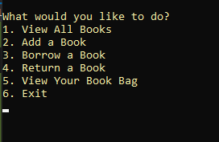

# Sultan-Lending-Library
This is a C# console application that simulates a library system where user has the ability to manipulate a collection of books.

using this library you can borrow books put it in the bag and add new books.
# Visuals

## Start Menu

## View All Books

## Add a Book

## Borrow a Book

# tests :

